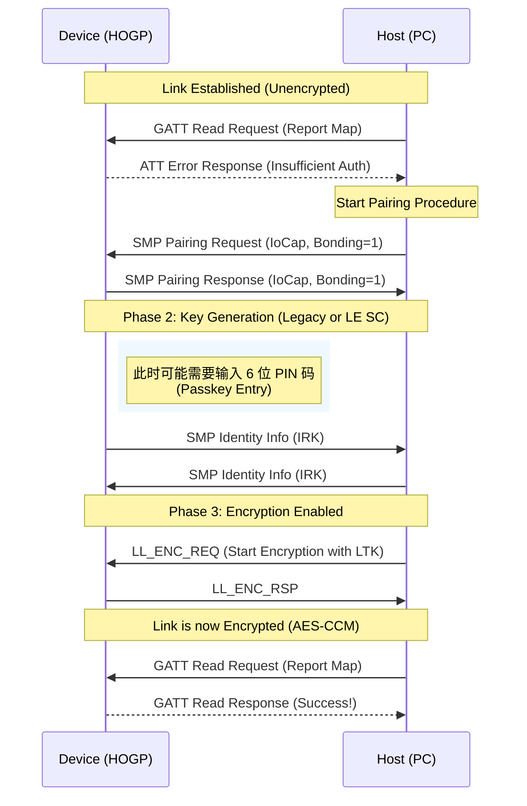

# GAP 视角下的 HOGP：从配对到加密全景解析

本文档从 **GAP (Generic Access Profile)** 的宏观视角，深入剖析一个 HOGP 设备（如蓝牙键盘）如何从零开始被主机发现、建立安全连接，并最终成为受信任的输入设备。

> **前置知识**: 请先阅读 [GAP 模式与过程](../../vol3_host/gap_modes_procedures.md) 理解 Central/Peripheral 角色定义。
> **核心参考**: *Bluetooth Core Spec v6.2, Vol 3, Part C (GAP)*

---

## 1. 舞台角色与剧本 (Roles & Modes)

在 HOGP 的剧本中，角色分配是固定的：

*   **Peripheral (外设)**: 你的 HOGP 设备 (Keyboard/Mouse)。
    *   **GAP Role**: Peripheral
    *   **职责**: 广播存在、接受连接、提供服务。
*   **Central (中心)**: 电脑 (PC) 或手机 (Phone)。
    *   **GAP Role**: Central
    *   **职责**: 扫描、发起连接、管理安全。

---

## 2. 第一幕：被发现 (Discovery)

设备通电或按下配对键，进入 **Discoverable Mode**。

### 2.1 广播数据 (Advertising Data)
为了让 Windows/Android 识别出“这是一个键盘”并愿意发起连接，广播数据必须包含特定的 **AD Type**。

| AD Type | 必须/可选 | 描述 | 典型值 (Hex) |
| :--- | :--- | :--- | :--- |
| **Flags (`0x01`)** | **必须** | 宣告可发现性与不支持经典蓝牙。 | `02 01 06` (General Disc + BR/EDR Not Supported) |
| **UUIDs (`0x03`)** | **必须** | 宣告包含 HID Service。 | `03 03 12 18` (0x1812 HID Service) |
| **Appearance (`0x19`)**| **必须** | 图标暗示 (键盘/鼠标)。 | `03 19 C1 03` (Keyboard: 0x03C1) |
| **Local Name (`0x09`)**| 可选 | 设备名。 | `05 09 4B 65 79 73` ("Keys") |

> **Tech Insight**: 如果缺少 **UUID 0x1812** 或 **Appearance**，Windows 可能会把它归类为“其他设备”而不是“输入设备”，导致连接后无法自动加载驱动。
> *参考*: [GAP 广播数据格式详解](../../vol3_host/gap_advertising_data.md)

### 2.2 建立连接 (Connection Establishment)
主机扫描到上述广播后，发送 `CONNECT_IND`。
*   **物理层**: 双方同步跳频序列。
*   **链路层**: 进入 **Connection State**，开始维持心跳 (Keep-alive)。

---

## 3. 第二幕：安全握手 (Security & Pairing)

HOGP 规范强制要求链路加密 (**Security Mode 1, Level 2/3**)。
连接建立之初，链路是**明文**的。此时尝试读取 HID 数据会被拒绝，从而触发配对。

### 3.1 触发机制 (Trigger)
1.  **主机**: 尝试读取敏感数据 (如 Report Map 或 Report Characteristic)。
2.  **设备**: GAP 层拦截请求，返回 ATT Error: **`Insufficient Authentication` (0x05)**。
3.  **主机**: 收到错误，意识到需要配对，启动 **SMP (Security Manager Protocol)** 流程。

### 3.2 配对流程 (Mermaid Sequence)

### 3.3 密钥分发 (Key Distribution)
配对成功后，双方会交换并存储以下密钥（Bonding）：
*   **LTK (Long Term Key)**: 长期密钥，用于加密后续所有的连接。
*   **IRK (Identity Resolving Key)**: 身份解析密钥，用于解析私有地址 (RPA)，防止设备被追踪，同时实现白名单回连。

---

## 4. 第三幕：回连与信任 (Reconnection)

一旦完成 Bonding，设备就可以在断开后快速“回连”，无需再次输入密码或扫描服务。

### 4.1 定向广播 (Directed Advertising)
设备唤醒（如按键）时，发送 **`ADV_DIRECT_IND`**。
*   **特点**: 包含主机的特定 MAC 地址。
*   **速度**: 极快 (Duty Cycle High)，主机收到即连。

### 4.2 隐私地址解析 (Privacy)
现代 OS (iOS/Win10) 会频繁更换随机 MAC 地址 (RPA)。
*   **挑战**: 设备广播的“目标地址”和主机的“当前地址”可能对不上。
*   **解法**: GAP 层使用之前存储的 **IRK** 解析地址。只要解析结果匹配，就视为同一台设备，允许重连。

### 4.3 恢复加密
回连建立后，主机直接发起 `LL_ENC_REQ` (使用存储的 LTK)。
*   **结果**: 握手过程从几秒缩短到几十毫秒。GATT 服务发现被跳过 (Caching)，直接进入工作状态。

---

## 5. 总结：GAP 的核心职责

在 HOGP 应用中，GAP 负责：
1.  **身份名片**: 通过 Flags/UUID/Appearance 告诉世界“我是键盘”。
2.  **安全门卫**: 拦截未加密的访问，强制执行 SMP 配对。
3.  **信任管家**: 管理 Bonding 信息 (LTK/IRK)，确保只有主人的电脑能自动回连。

> **下一步**: 连接加密建立后，控制权移交给 GATT 层进行服务配置。
> 请参阅: [HOGP 初始化与配置 (ATT Flow)](hogp_initialization_packet_flow.md)
