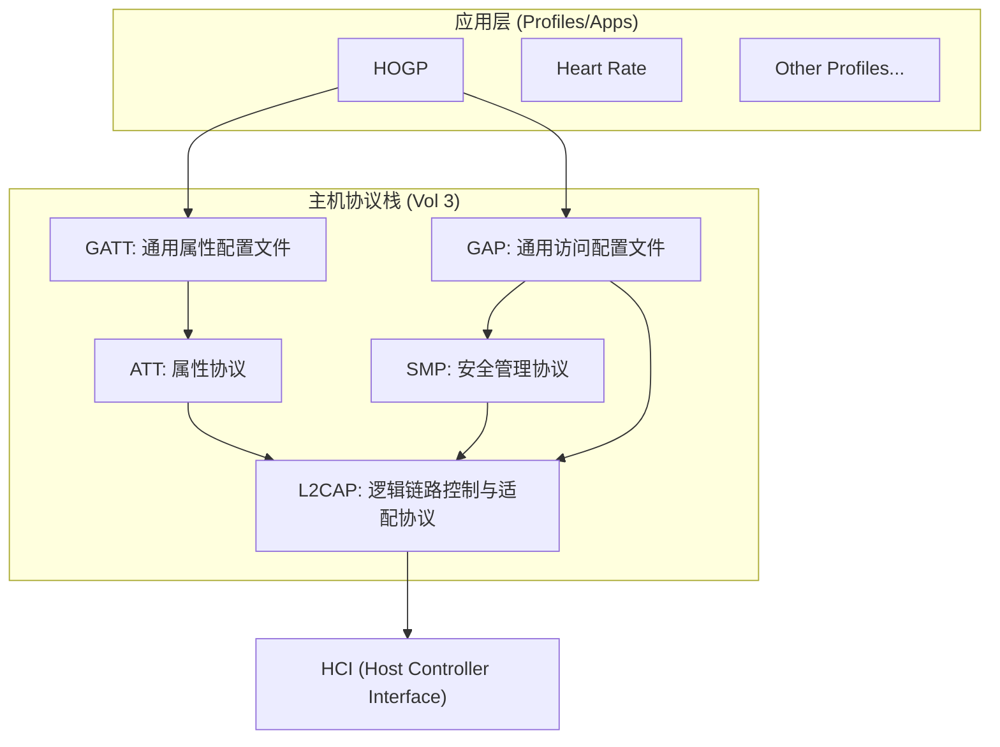

# Bluetooth Host Stack Overview (主机协议栈总览)

蓝牙主机（Host）协议栈位于 HCI 层之上，负责处理逻辑链路、安全、属性管理以及应用程序的通用访问。

---

## 1. 协议层级架构 (Protocol Hierarchy)

Host 层由多个相互协作的模块组成，典型的分层结构如下：

---

## 2. 核心组件职责 (Core Components)

### 2.1 [L2CAP (Logical Link Control and Adaptation Protocol)](l2cap/)
*   **地位**: Host 层的最底层，所有上层协议（ATT, SMP）都跑在 L2CAP 之上。
*   **职责**:
    *   **多路复用**: 通过 CID (Channel ID) 区分不同的上层协议。
    *   **分段与重组 (SAR)**: 处理超过 MTU 大小的数据包。
    *   **LE 信用流量控制**: 用于高带宽数据传输。

### 2.2 [ATT (Attribute Protocol)](att/)
*   **地位**: 数据的“搬运工”。
*   **职责**: 定义了简单的客户端/服务器架构。数据以 **Attribute** 形式存在，通过 **Handle** 进行读、写、通知 (Notification) 和指示 (Indication)。

### 2.3 [GATT (Generic Attribute Profile)](gatt/)
*   **地位**: 数据的“管理员”。
*   **职责**: 在 ATT 之上建立了层级结构（Service -> Characteristic -> Descriptor）。定义了**服务发现 (Service Discovery)** 的子流程。

### 2.4 [SMP (Security Manager Protocol)](smp/)
*   **地位**: “保安”。
*   **职责**: 负责身份验证、配对 (Pairing)、绑定 (Bonding) 以及密钥分发。它是链路加密（AES-CCM）的逻辑基础。

### 2.5 [GAP (Generic Access Profile)](gap/)
*   **地位**: “联络员与规则制定者”。
*   **职责**: 定义了设备如何发现、如何连接以及如何确保安全。它决定了设备在物理层和链路层表现出的角色（Central/Peripheral/Observer/Broadcaster）。

---

## 3. 目录索引

*   [**GAP**](gap/): 发现模式、连接过程、角色定义。
*   [**GATT**](gatt/): 服务架构、发现子流程、GATT 缓存。
*   [**ATT**](att/): PDU 格式、Handle 机制、操作码。
*   [**SMP**](smp/): 配对算法、密钥分发、安全等级。
*   [**L2CAP**](l2cap/): 逻辑通道、流量控制、MTU 管理。
*   [**Raw Data**](raw/): 原始 Spec 提取文本归档。

---

## 4. 关键跨层流程

1.  **连接建立**: GAP (Central) -> L2CAP (Connection Request) -> HCI。
2.  **安全触发**: GATT (Read) -> ATT (Error: Insufficient Auth) -> SMP (Pairing)。
3.  **数据传输**: Profile -> GATT -> ATT -> L2CAP -> HCI。
