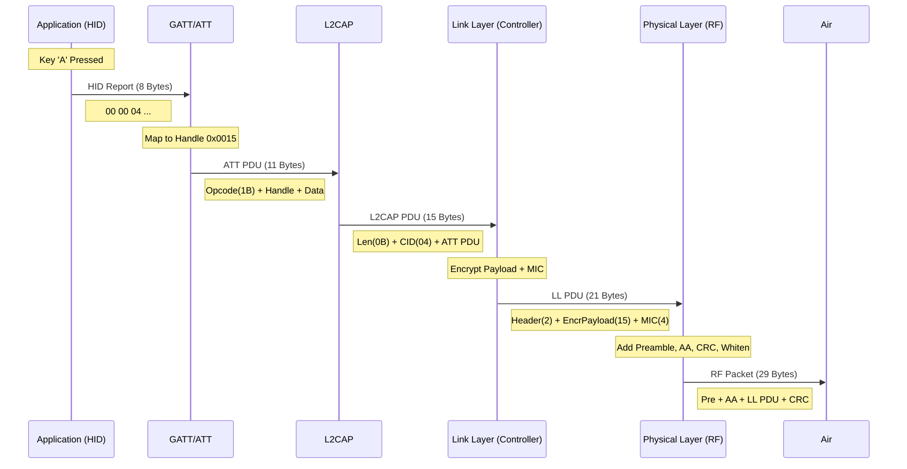

# 从按键到RF PHY：HID Report 全栈数据流解构

本文档旨在“显微镜”式地解构一个 HID 键盘按键事件（如按下 'A' 键）如何从应用层生成，经过蓝牙协议栈各层封装，最终转化为物理层（PHY）的空口信号。

**场景假设**:
*   **设备**: BLE 键盘 (HOGP Server)
*   **事件**: 用户按下 'A' 键 (Usage ID: 0x04)
*   **物理层**: LE 1M PHY
*   **安全**: 已加密 (Encrypted Link, HOGP 强制要求)

---

## 1. 应用层 (Application Layer): 原始 HID Report

固件检测到按键扫描矩阵的变化，生成符合 Report Descriptor 定义的原始数据。

*   **数据内容**: 标准 8 字节键盘报告
*   **Hex 视图**:
    ```text
    00 00 04 00 00 00 00 00
    ```
    *   `Byte 0`: 0x00 (无 Modifier 键)
    *   `Byte 1`: 0x00 (Reserved)
    *   `Byte 2`: **0x04** (Key 'A')
    *   `Byte 3-7`: 0x00 (无其他按键)

---

## 2. HOGP/GATT Layer: Service & UUID Mapping

在数据进入 ATT 管道之前，必须明确“它是谁的数据”。HOGP (HID over GATT Profile) 定义了这种映射关系。

*   **Service**: HID Service (UUID: `0x1812`)
*   **Characteristic**: Report (UUID: `0x2A4D`)
    *   **Descriptors**:
        *   Client Characteristic Configuration (CCCD, `0x2902`): 允许 Notification。
        *   Report Reference (`0x2908`): 定义 Report ID 和类型 (Input/Output)。

**Handle 的由来**:
在设备初始化时，GATT 表被创建，每个特征值（Value）都会被分配一个唯一的 16-bit **Attribute Handle**。
假设 Firmware 定义如下：
*   Handle `0x0014`: Report Characteristic Declaration
*   **Handle `0x0015`: Report Characteristic Value (这里存储 HID 数据)**
*   Handle `0x0016`: Report Reference Descriptor

因此，当我们说“发送 HID Report”时，实际上是向 Handle `0x0015` 进行操作。

> **Tech Insight: UUID 去哪了？**
> 
> 在最终传输的 ATT 报文（Section 3）中，**完全不存在** `0x1812` 或 `0x2A4D` 这些 UUID。
> *   **初始化阶段 (Discovery)**: 主机通过读取 UUID 建立映射表（如：Handle `0x0015` = 键盘输入）。
> *   **运行阶段 (Runtime)**: 仅传输 2 字节的 **Handle** (`15 00`)。
> 
> 这种设计避免了在每个微小的数据包中重复传输冗长的 16-bit/128-bit UUID，是 BLE 低功耗与高效率的关键设计之一。

---

## 3. ATT 层: Handle Value Notification (PDU)

HID Report 被封装为 ATT 协议数据单元 (PDU)。HOGP 规范强制要求 Input Report 使用 **Notification** (无需主机应用层确认，低延迟)。

*   **封装动作**: 组合 Opcode、Handle 和 HID 数据。
*   **ATT PDU 结构**:
    *   **Opcode (1 Byte)**: `0x1B` (Handle Value Notification)
    *   **Handle (2 Bytes)**: `0x0015` (来自上一节的映射)
    *   **Value (8 Bytes)**: 原始 HID Report Data
*   **Hex 视图 (11 Bytes)**:
    ```text
    1B 15 00 00 00 04 00 00 00 00 00
    ^  ^---^ ^---------------------^
    Op Handle      HID Payload
    ```

---

## 4. L2CAP 层: Logical Link Encapsulation

ATT PDU 作为一个完整的 SDU 传递给 L2CAP 层。由于在 BLE 中使用固定通道 (Fixed Channel)，不需要复杂的连接头，只需添加 Basic Header。

*   **封装动作**: 添加长度和通道 ID。
*   **L2CAP PDU 结构**:
    *   **Length (2 Bytes)**: `0x000B` (11 Bytes, 小端序: `0B 00`)
    *   **CID (2 Bytes)**: `0x0004` (Attribute Protocol CID, 小端序: `04 00`)
    *   **Payload (11 Bytes)**: ATT PDU
*   **Hex 视图 (15 Bytes)**:
    ```text
    0B 00 04 00 1B 15 00 00 00 04 00 00 00 00 00
    ^---^ ^---^ ^------------------------------^
    Len   CID            ATT PDU
    ```

---

## 5. Link Layer (LL): Data Channel PDU & Encryption

L2CAP PDU 进入链路层。此时处于连接状态 (Connection State)，使用 Data Physical Channel PDU。由于 HOGP 强制加密，这里会涉及 MIC (Message Integrity Check) 计算和载荷加密。

*   **封装动作**: 添加 LL Header，计算 MIC，加密 Payload + MIC。
*   **LL Header (2 Bytes)**:
    *   **LLID (2 bits)**: `10b` (Start of an L2CAP message or complete message).
    *   **NESN/SN (1 bit each)**: 序列号控制 (用于 ACK/重传).
    *   **MD (1 bit)**: More Data (0 = 没更多数据).
    *   **Length (8 bits)**: L2CAP PDU (15) + MIC (4) = 19 Bytes (`0x13`).
    *   *Hex*: 假设 SN=0, NESN=0, MD=0 -> Header = `02 13` (小端序).
*   **MIC (4 Bytes)**: 这里的 MIC 是 CCM 算法生成的完整性校验码。
*   **Encryption**: `L2CAP PDU (15) + MIC (4)` 这一段共 19 字节会被 AES-CCM 密钥流异或加密。

*   **LL PDU (21 Bytes)**:
    ```text
    02 13 [ Encrypted ( L2CAP PDU ... + MIC ) ]
    ^---^ ^-----------------------------------^
    Header          Ciphertext Payload
    ```

---

## 6. 物理层 (RF PHY): Air Interface Packet

LL PDU 被送入调制器，转化为最终的 RF 空口比特流。以 **LE 1M PHY** 为例。

*   **封装动作**: 添加前导码、接入地址、CRC，并进行白化 (Whitening)。
*   **Packet 结构**:
    1.  **Preamble (1 Byte)**: `0xAA` 或 `0x55` (取决于接入地址 LSB，用于时钟同步)。
    2.  **Access Address (4 Bytes)**: 连接唯一的接入地址 (如 `0x5E 0xC6 0x82 0x1A`)。
    3.  **PDU (21 Bytes)**: 上一步生成的 LL PDU。
    4.  **CRC (3 Bytes)**: 对 PDU 计算的循环冗余校验。

*   **最终数字域报文 (29 Bytes, 232 µs)**:
    ```text
    AA | 1A 82 C6 5E | 02 13 XX..[19 Bytes]..XX | YY YY YY
    ^    ^---------^   ^----------------------^   ^------^
    Pre  Access Addr          LL PDU                CRC
    ```
    *(注: PDU 和 CRC 部分会在发送前经过白化处理)*

---

## 7. 全景图 (Mermaid Data Flow)



---

## 总结: 开销分析

为了发送 **1 个字节** 的有效信息（Keycode 'A'）：
1.  **HID 层**: 补齐到 8 字节 (+7 overhead).
2.  **ATT 层**: +3 字节 (Opcode, Handle).
3.  **L2CAP 层**: +4 字节 (Len, CID).
4.  **LL 层**: +6 字节 (Header, MIC).
5.  **PHY 层**: +8 字节 (Preamble, AA, CRC).

**总计**: 8 (HID) -> 29 (PHY) Bytes。
虽然层层封装增加了约 2.6 倍的开销，但换来了：
*   **多路复用** (Handle/CID)
*   **数据完整性** (CRC/MIC)
*   **安全性** (Encryption)
*   **可靠传输** (SN/NESN ACK机制)
