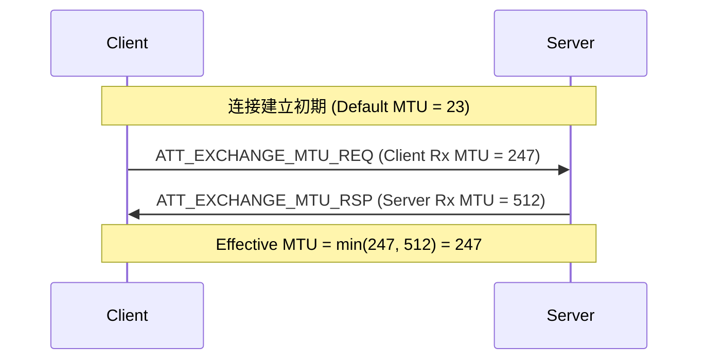

# Attribute Protocol (ATT) 深度解析

**ATT (Attribute Protocol)** 是蓝牙低功耗 (BLE) 数据传输的基石。GATT (Generic Attribute Profile) 定义了数据的逻辑结构（服务/特征），而 ATT 则定义了这些数据如何在空口进行具体的字节级传输。

> **核心参考**: *Bluetooth Core Spec v6.2, Vol 3, Part F*

---

## 1. 协议基础 (Protocol Basics)

ATT 是一个基于 **Client/Server** 架构的协议：
*   **Server**: 存储数据（Attributes）的一方（如手环）。
*   **Client**: 请求读写数据的一方（如手机）。

### 1.1 Attribute 三要素
每个 Attribute 由三个核心部分组成：

1.  **Attribute Handle (16-bit)**: 数据的唯一地址（类似内存地址，如 `0x0012`）。
2.  **Attribute Type (UUID)**: 数据的类型（如 `0x2A37` 代表心率测量值）。
3.  **Attribute Value**: 实际的数据内容。

---

## 2. 核心 PDU 结构详解 (Detailed PDU Formats)

ATT PDU 嵌入在 L2CAP 的 B-Frame 中（CID = `0x0004`）。
Opcode 的 Bit 6 决定了它是否是 Command (无响应)，Bit 7 决定了是否有签名。

以下列出 HOGP 开发中最常见的 PDU 载荷结构。

### 2.1 错误响应 (Error Handling)
当请求失败时（如权限不足、Handle 无效），Server 返回此 PDU。

*   **Opcode**: `0x01` (ATT_ERROR_RSP)

| PDU Field | Length | Description |
| :--- | :--- | :--- |
| **Request Opcode** | 1 | 触发错误的那个请求的 Opcode (如 0x08)。 |
| **Attribute Handle** | 2 | 导致错误的 Handle。 |
| **Error Code** | 1 | 错误原因 (如 `0x05` Insufficient Auth)。 |

### 2.2 服务发现 (Discovery)
用于查找 UUID 对应的 Handle（如寻找 Report 特征值）。
> **关联阅读**: 完整的发现流程见 [GATT Service Discovery](../gatt/service_discovery.md)。

*   **Request**: `0x08` (ATT_READ_BY_TYPE_REQ)

| Field | Length | Description |
| :--- | :--- | :--- |
| **Start Handle** | 2 | 搜索起始位置。 |
| **End Handle** | 2 | 搜索结束位置。 |
| **UUID** | 2 or 16 | 要查找的类型 (如 `0x2803`)。 |

*   **Response**: `0x09` (ATT_READ_BY_TYPE_RSP)

| Field | Length | Description |
| :--- | :--- | :--- |
| **Length** | 1 | 后面每个 Data Item 的长度。 |
| **Data List** | N | `{Handle, Value}` 列表。 |

### 2.3 配置写入 (Configuration)
用于 HOGP 的 LED 控制或开启 CCCD 通知。

*   **Request**: `0x12` (ATT_WRITE_REQ)

| Field | Length | Description |
| :--- | :--- | :--- |
| **Handle** | 2 | 目标 Attribute Handle。 |
| **Value** | 0 to (MTU-3) | 要写入的数据。 |

*   **Response**: `0x13` (ATT_WRITE_RSP) - **Empty PDU** (只有 Opcode)。

### 2.4 数据上报 (HOGP Input)
用于键盘/鼠标上报按键数据。**这是 HOGP 中流量最大的 PDU**。

*   **Notification**: `0x1B` (ATT_HANDLE_VALUE_NTF)

| Field | Length | Description |
| :--- | :--- | :--- |
| **Handle** | 2 | Report Characteristic Value Handle。 |
| **Value** | 0 to (MTU-3) | HID Report Payload (如 8 字节按键数据)。 |

> **注意**: Client **不回复**此 PDU。

---

## 3. 事务处理规则 (Transaction Rules)

ATT 协议是一个**顺序协议 (Sequential Protocol)**。

1.  **Request-Response 锁**: Client 发送一个 Request (如 `Write Request`) 后，**必须等待** Server 返回 Response (如 `Write Response`) 或 Error Response，才能发送下一个 Request。
    *   *违规后果*: 如果不等回复就发下一个，Link Layer 可能会断开连接。
2.  **Command/Notification 例外**: 
    *   `Write Command` (Client -> Server) 和 `Notification` (Server -> Client) 是**异步**的，不需要等待，可以连续发送。
    *   *流控*: 唯一的限制是 Link Layer 的 TX Buffer 和带宽。
3.  **Indication 锁**: Server 发送 `Indication` 后，必须等待 Client 返回 `Confirmation` 才能发下一个。

---

---

## 4. MTU 交换流程 (MTU Exchange)

BLE 默认的 ATT MTU 是 **23 字节** (3 bytes Header + 20 bytes Data)。为了提高吞吐量，双方必须协商更大的 MTU。

*   **规则**: 最终使用的 MTU 是 `min(Client_Rx_MTU, Server_Rx_MTU)`。
*   **时机**: 通常在连接建立且加密完成后立即进行。
*   **注意**: 只有 Client 能发起 Request。

---

## 5. 常见错误码 (Error Codes)

当 Server 返回 `ATT_ERROR_RSP (0x01)` 时，第三个字节是 Error Code：

| Code | Name | Meaning |
| :--- | :--- | :--- |
| `0x01` | **Invalid Handle** | 请求的 Handle 不存在。 |
| `0x03` | **Write Not Permitted** | 该属性不支持写操作。 |
| `0x05` | **Insufficient Authentication** | 链路未加密或未配对。 |
| `0x0A` | **Attribute Not Found** | 指定范围内没找到属性。 |
| `0x0D` | **Invalid Attribute Value Length** | 写入的数据长度不对。 |

---

## 6. 开发者贴士

1.  **Write Command vs Request**: 需要高吞吐且允许丢包（如计步器实时数据）用 `Write Command`；需要可靠性（如配置参数）用 `Write Request`。
2.  **MTU 陷阱**: 即使协商了 MTU = 247，L2CAP 可能会对数据进行分片传输，应用层看到的是完整的 244 字节数据，但底层可能拆成了多个空口包。
3.  **Indication 阻塞**: Indication 是“停等协议”，在收到 CFM 之前不能发送下一个 Indication。不要用它传高频数据。
