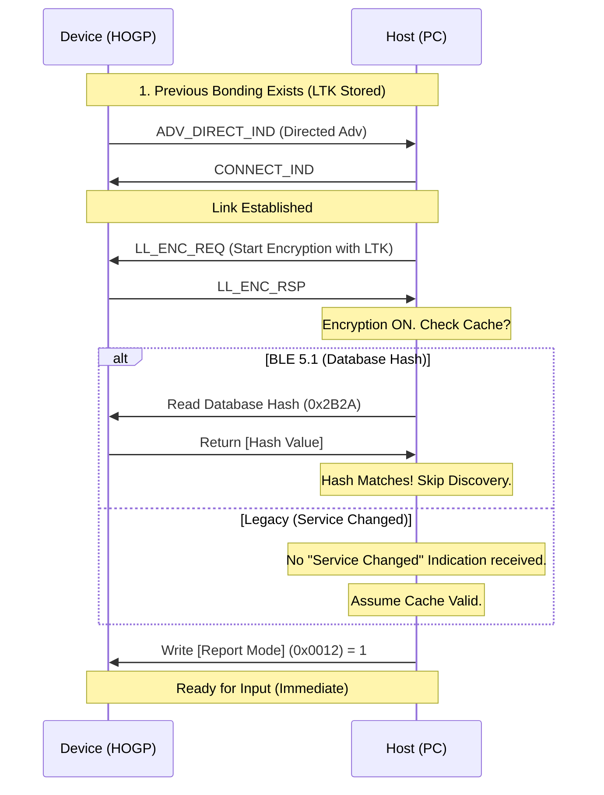

# GATT Caching & Robustness (缓存与健壮性)

在 BLE 连接中，**服务发现 (Service Discovery)** 是一个耗时且费电的过程（涉及数十次空口交互）。为了实现“秒连”体验，蓝牙 5.1 引入了 **GATT Caching** 机制。

> 核心规范参考: **Vol 3, Part G, Section 2.5.2 & Section 7**

---

## 1. 为什么需要缓存？ (The Problem)

如果没有缓存，每次连接（尤其是异常断开重连）时，Host 都必须重新执行完整的服务发现流程，耗时可能长达 1-2 秒。
在此期间，用户按键无效，体验极差。

**目标**: Host 只在第一次连接时“查户口”，之后只要设备的户口（GATT 表）没变，就直接使用内存里缓存的 Handle 映射表。

---

## 2. 核心机制：怎么知道“变没变”？

### 2.1 Service Changed Characteristic (`0x2A05`)
这是 GATT Service (`0x1801`) 下的一个特征。
*   **作用**: 当 Server 的数据库结构发生变化（如固件升级增加了新服务）时，Server **必须**向已绑定的 Client 发送 **Indication**。
*   **Value**: `{Start Handle, End Handle}`，指示变化发生的范围。
*   **Client 行为**: 收到 Indication 后，Client 认为缓存失效，重新扫描该范围内的服务。

> **局限**: 这依然依赖于连接建立后的交互。如果 Host 没收到 Indication 怎么办？

### 2.2 Database Hash (`0x2B2A`) - BLE 5.1+
这是一个位于 **Generic Attribute Service** 下的特征。
*   **定义**: 一个 128-bit (16 Byte) 的哈希值（通常是 AES-CMAC），基于整个 GATT 数据库的结构计算得出。
*   **流程**:
    1.  连接建立。
    2.  Host 读取设备的 `Database Hash`。
    3.  Host 对比自己缓存的 Hash。
    4.  **Match**: 完美！直接跳过所有发现过程，立即开始工作。
    5.  **Mismatch**: 缓存失效，重新执行服务发现。

---

## 3. Client Supported Features (`0x2B29`)

Server 也需要知道 Client 是否支持缓存（Robust Caching）。
*   Client 写入此特征，告知 Server：“我支持由 Database Hash 保证的健壮缓存”。
*   **Server 的收益**: 如果 Client 支持缓存，Server 在通过 `Service Changed` 通知变化时，就不需要等待 Client 的确认，也不用担心 Client 访问到错误的 Handle（因为 Client 会先查 Hash）。

---

## 4. HOGP 秒连实战 (Fast Reconnection Flow)

结合 GAP Bonding 和 GATT Caching，HOGP 设备的重连流程如下：

---

## 5. 常见问题 (Troubleshooting)

### 5.1 为什么固件升级后无法控制？
*   **原因**: 固件修改了 GATT 表（增删了特征），导致 Handle 偏移。但 Host 依然用旧的 Handle（如 `0x0015`）去写数据，结果写到了错误的地方。
*   **解法**:
    1.  固件升级后，必须触发 `Service Changed` Indication。
    2.  或者，开发阶段在手机端“取消配对”并“忘记设备”，强制清除 Host 缓存。

### 5.2 "Attribute Not Found" 错误
*   通常发生在缓存失效但 Host 未察觉时。Host 访问了不存在的 Handle。

---

## 6. 总结

*   **Service Changed**: 传统的通知机制，告诉 Host “表变了”。
*   **Database Hash**: 现代的校验机制，让 Host 主动检查 “表变没变”。
*   **Robust Caching**: 使得连接建立后的延迟从“秒级”降低到“毫秒级”，是 HOGP 体验的关键。
