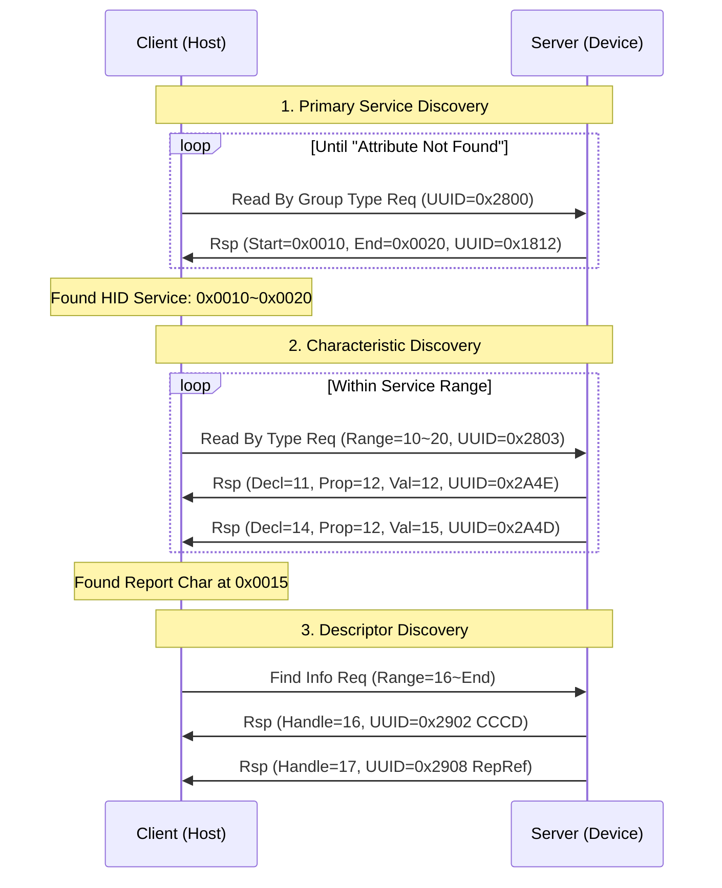
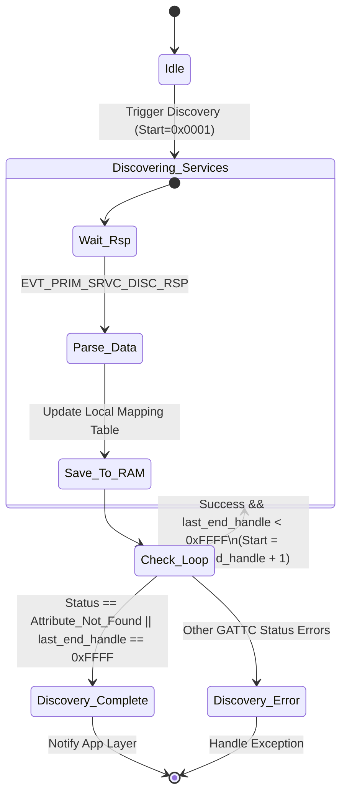

# GATT Service Discovery (服务发现子过程)

**服务发现 (Service Discovery)** 是 GATT Client 连接 Server 后，建立“UUID -> Handle”映射表的核心过程。GATT 规范 (Vol 3, Part G, Section 4.4) 定义了一系列标准的子过程 (Sub-procedures) 来完成这一任务。

---

## 1. 发现主服务 (Primary Service Discovery)

这是“查户口”的第一步。Client 需要知道 Server 上都有哪些主要功能模块（Service）。

### 1.1 Discover All Primary Services
*   **目标**: 获取 Server 上**所有**的主服务列表。
*   **ATT 操作**: `Read By Group Type Request`
    *   **Start Handle**: `0x0001`
    *   **End Handle**: `0xFFFF`
    *   **UUID**: `0x2800` (Primary Service Declaration)
*   **状态机逻辑**:
    1.  Client 发送请求。
    2.  Server 返回 `Read By Group Type Response`，包含一组或多组 `{Start Handle, End Handle, Service UUID}`。
    3.  Client 记录收到的服务。
    4.  Client 更新 `Start Handle` 为（收到的最后一个 End Handle + 1）。
    5.  重复步骤 1，直到 Server 返回 `Error Response (Attribute Not Found)`，表示遍历结束。

> **ATT 报文示例**:
> *   REQ: `10 01 00 FF FF 00 28` (查 0x2800)
> *   RSP: `11 06 10 00 20 00 12 18` (发现 HID Service 0x1812, 范围 0x0010-0x0020)

### 1.2 Discover Primary Service by Service UUID
*   **目标**: 已知 UUID，只查找特定服务（如只找 HID Service）。
*   **ATT 操作**: `FindByTypeValueRequest` (优化路径) 或 `Read By Group Type Request` (带特定 UUID)。
*   **优势**: 减少空中数据量，只返回感兴趣的服务。

---

## 2. 发现特征值 (Characteristic Discovery)

在锁定某个 Service 的范围（如 `0x0010` - `0x0020`）后，Client 需要深入该范围，找出所有的特征（如 Report, Protocol Mode）。

### 2.1 Discover All Characteristics of a Service
*   **目标**: 遍历服务内的所有特征。
*   **ATT 操作**: `Read By Type Request`
    *   **Range**: Service 的 Start Handle 到 End Handle。
    *   **UUID**: `0x2803` (Characteristic Declaration)。
*   **返回结构**:
    *   `Attribute Handle`: 特征声明本身的 Handle。
    *   `Characteristic Properties`: 读/写/通知权限 (Bitmap)。
    *   `Characteristic Value Handle`: **最关键的 Handle**，用于读写实际数据。
    *   `Characteristic UUID`: 特征的类型 (e.g., `0x2A4D`)。

---

## 3. 发现描述符 (Descriptor Discovery)

特征值之后，可能跟随描述符（如 CCCD）。Client 需要确定特征值的结束位置和下一个特征的开始位置之间的空隙。

### 3.1 Discover All Characteristic Descriptors
*   **目标**: 识别特征值 Value Handle 之后的所有属性，直到下一个特征或服务结束。
*   **ATT 操作**: `Find Information Request`
    *   **Range**: (Value Handle + 1) 到 (Next Characteristic Handle - 1)。
*   **返回**: `{Handle, UUID}` 对列表。
*   **典型结果**:
    *   `0x2902`: Client Characteristic Configuration (CCCD) -> 必须配置它来开启 Notify。
    *   `0x2908`: Report Reference -> 区分 Input/Output Report。

---

## 4. 完整流程图 (Mermaid)

## 5. 总结

服务发现是 ATT 操作的组合拳：
1.  **宏观**: 用 `0x2800` 划定服务边界。
2.  **微观**: 用 `0x2803` 扫描边界内的特征节点。
3.  **补充**: 用 `Find Info` 扫清特征后的描述符尾巴。

这一过程完成后，Client 就拥有了完整的 Handle Map，可以进入“秒连”阶段的逻辑（见 [GATT Caching](caching_robustness.md)）。

---

## 6. 嵌入式固件实战 (Firmware Implementation)

在嵌入式开发（如 Nordic nRF5 SDK 或 Zephyr）中，开发者不需要手动构建 ATT 字节流，而是调用协议栈提供的 API。理解上述 ATT 流程有助于正确编写**状态机**和处理**事件**。

### 6.1 API 映射表

| ATT Procedure | Nordic SoftDevice API | Zephyr API |
| :--- | :--- | :--- |
| **Discover Primary Service** | `sd_ble_gattc_primary_services_discover` | `bt_gatt_discover` (type=`BT_GATT_DISCOVER_PRIMARY`) |
| **Discover Characteristics** | `sd_ble_gattc_characteristics_discover` | `bt_gatt_discover` (type=`BT_GATT_DISCOVER_CHARACTERISTIC`) |
| **Discover Descriptors** | `sd_ble_gattc_descriptors_discover` | `bt_gatt_discover` (type=`BT_GATT_DISCOVER_DESCRIPTOR`) |

### 6.2 异步迭代状态机 (State Machine)

服务发现是一个异步的、分步的过程。开发者必须构建一个状态机来处理协议栈抛出的事件，并决定是继续下一次迭代还是结束流程。

### 6.3 内存与 Buffer 限制 (Pitfalls)

1.  **Event Buffer**: `Read By Group Type Response` 一个包可能包含多个服务（如 3-4 个）。如果你的 `ble_evt_t` 缓冲区太小，可能会丢数据（虽然 SoftDevice 通常会在底层分包）。
2.  **Discovery 速度**: 每次 API 调用对应一次空口往返 (RTT)。如果你发现一个服务包含 50 个特征，逐个发现可能需要几百毫秒。这再次印证了 [GATT Caching](caching_robustness.md) 的重要性。
